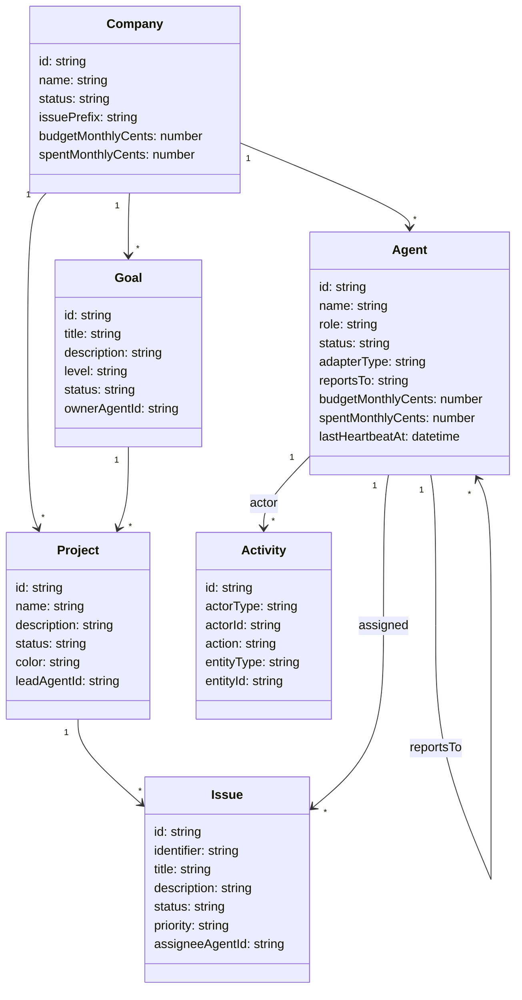

# RECIPE.md — Requirements to Running App

> A step-by-step pipeline for turning natural language requirements into a working
> LOSOS app backed by MongoDB via JSS. Each step produces an artifact that feeds
> the next. An agent can execute the entire pipeline.

## Step 1: Requirements

Write plain English describing what the system does and who uses it.

### Paperclip Requirements

Paperclip is an orchestration platform for autonomous AI companies.

**Users:** A human board of directors who oversee AI agents.

**Core workflows:**
- Define company goals (e.g. "Build a media platform on Nostr")
- Create projects to achieve those goals
- Hire AI agents with specific roles (CEO, CTO, Engineer, Designer, Marketer)
- Agents report to other agents in a hierarchy
- Break work into issues assigned to agents
- Agents check out issues, work on them, and complete them
- Track costs and budgets per agent
- Monitor agent heartbeats and status
- View activity feed of all actions
- Approve agent requests that need human oversight

**Agents can:**
- Be started, paused, and stopped
- Have configurable heartbeat intervals
- Use different adapters (Claude, Codex, Cursor, etc.)
- Create other agents (if permitted)
- Create and complete issues

---

## Step 2: UML

Extract entities, attributes, and relationships from requirements.

### Entity Diagram (Mermaid)



### Relationships Summary

```
Company  1 → * Goal
Company  1 → * Project
Company  1 → * Agent
Goal     1 → * Project      (goalId)
Project  1 → * Issue        (projectId)
Agent    1 → * Issue         (assigneeAgentId)
Agent    1 → * Agent         (reportsTo)
Goal     1 → 1 Agent        (ownerAgentId)
Project  1 → 1 Agent        (leadAgentId)
Activity * → 1 Agent        (actorId / agentId)
```

---

## Step 3: Tables

Translate UML entities to flat document schemas. Each entity is a MongoDB collection.

| Collection | Fields |
|---|---|
| **companies** | id, name, status, issuePrefix, budgetMonthlyCents, spentMonthlyCents, createdAt, updatedAt |
| **goals** | id, companyId, title, description, level, status, ownerAgentId, parentId, createdAt, updatedAt |
| **projects** | id, companyId, goalId, name, description, status, color, leadAgentId, createdAt, updatedAt |
| **agents** | id, companyId, name, role, icon, status, adapterType, reportsTo, budgetMonthlyCents, spentMonthlyCents, lastHeartbeatAt, pauseReason, permissions, runtimeConfig, createdAt, updatedAt |
| **issues** | id, companyId, projectId, goalId, identifier, title, description, status, priority, assigneeAgentId, createdAt, updatedAt |
| **activity** | id, companyId, actorType, actorId, action, entityType, entityId, agentId, createdAt |

---

## Step 4: Objects

Create 3-5 sample documents per collection. These become the seed data.

```json
{
  "@context": {
    "schema": "http://schema.org/",
    "dct": "http://purl.org/dc/terms/",
    "pc": "https://paperclip.ing/ns/"
  },
  "@id": "#this",
  "@type": "Company",
  "name": "Nostr Media",
  "status": "active",
  "pc:issuePrefix": "NOS"
}
```

```json
{
  "@id": "#agent-ceo",
  "@type": "Agent",
  "schema:name": "CEO",
  "pc:role": "ceo",
  "pc:status": "idle",
  "pc:adapterType": "claude_local",
  "pc:reportsTo": null,
  "pc:budgetMonthlyCents": 0,
  "pc:spentMonthlyCents": 0
}
```

```json
{
  "@id": "#issue-1",
  "@type": "Issue",
  "dct:title": "Hire founding engineer and create hiring plan",
  "dct:description": "Hire a founding engineer, write a hiring plan, delegate work.",
  "pc:identifier": "NOS-1",
  "pc:status": "in_progress",
  "pc:priority": "high",
  "pc:projectId": "#project-onboarding",
  "pc:assigneeAgentId": "#agent-ceo"
}
```

Full seed data: see `index.html` `window.__paperclip` block for all entities.

---

## Step 5: JSON Schema

Define validation schemas per entity. These drive form generation and API validation.

### Agent Schema

```json
{
  "$id": "https://paperclip.ing/schema/agent",
  "type": "object",
  "required": ["name", "role", "adapterType"],
  "properties": {
    "id": { "type": "string", "format": "uuid" },
    "name": { "type": "string", "minLength": 1, "maxLength": 100 },
    "role": {
      "type": "string",
      "enum": ["ceo", "cto", "engineer", "designer", "marketing", "sales", "ops", "custom"]
    },
    "icon": { "type": ["string", "null"] },
    "status": {
      "type": "string",
      "enum": ["idle", "running", "paused", "error"],
      "default": "idle"
    },
    "adapterType": {
      "type": "string",
      "enum": ["claude_local", "codex_local", "cursor_local", "gemini_local", "openclaw_gateway", "opencode_local", "pi_local"]
    },
    "reportsTo": { "type": ["string", "null"], "description": "Agent ID of manager" },
    "budgetMonthlyCents": { "type": "integer", "minimum": 0, "default": 0 },
    "spentMonthlyCents": { "type": "integer", "minimum": 0, "default": 0 },
    "pauseReason": { "type": ["string", "null"] },
    "permissions": {
      "type": "object",
      "properties": {
        "canCreateAgents": { "type": "boolean", "default": false }
      }
    },
    "runtimeConfig": {
      "type": "object",
      "properties": {
        "heartbeat": {
          "type": "object",
          "properties": {
            "enabled": { "type": "boolean", "default": true },
            "intervalSec": { "type": "integer", "minimum": 60, "default": 3600 },
            "maxConcurrentRuns": { "type": "integer", "minimum": 1, "default": 1 }
          }
        }
      }
    },
    "lastHeartbeatAt": { "type": ["string", "null"], "format": "date-time" },
    "createdAt": { "type": "string", "format": "date-time" },
    "updatedAt": { "type": "string", "format": "date-time" }
  }
}
```

### Issue Schema

```json
{
  "$id": "https://paperclip.ing/schema/issue",
  "type": "object",
  "required": ["title", "status", "priority"],
  "properties": {
    "id": { "type": "string", "format": "uuid" },
    "identifier": { "type": "string", "pattern": "^[A-Z]+-\\d+$" },
    "title": { "type": "string", "minLength": 1, "maxLength": 500 },
    "description": { "type": ["string", "null"] },
    "status": {
      "type": "string",
      "enum": ["backlog", "todo", "in_progress", "done", "cancelled"],
      "default": "todo"
    },
    "priority": {
      "type": "string",
      "enum": ["low", "medium", "high", "urgent"],
      "default": "medium"
    },
    "projectId": { "type": ["string", "null"] },
    "goalId": { "type": ["string", "null"] },
    "assigneeAgentId": { "type": ["string", "null"] },
    "createdAt": { "type": "string", "format": "date-time" },
    "updatedAt": { "type": "string", "format": "date-time" }
  }
}
```

### Project Schema

```json
{
  "$id": "https://paperclip.ing/schema/project",
  "type": "object",
  "required": ["name", "status"],
  "properties": {
    "id": { "type": "string", "format": "uuid" },
    "name": { "type": "string", "minLength": 1, "maxLength": 200 },
    "description": { "type": ["string", "null"] },
    "status": {
      "type": "string",
      "enum": ["planned", "in_progress", "completed", "paused", "archived"],
      "default": "planned"
    },
    "color": { "type": "string", "pattern": "^#[0-9a-fA-F]{6}$", "default": "#6366f1" },
    "goalId": { "type": ["string", "null"] },
    "leadAgentId": { "type": ["string", "null"] },
    "createdAt": { "type": "string", "format": "date-time" },
    "updatedAt": { "type": "string", "format": "date-time" }
  }
}
```

### Goal Schema

```json
{
  "$id": "https://paperclip.ing/schema/goal",
  "type": "object",
  "required": ["title", "level", "status"],
  "properties": {
    "id": { "type": "string", "format": "uuid" },
    "title": { "type": "string", "minLength": 1, "maxLength": 300 },
    "description": { "type": ["string", "null"] },
    "level": {
      "type": "string",
      "enum": ["company", "team", "individual"],
      "default": "company"
    },
    "status": {
      "type": "string",
      "enum": ["active", "completed", "paused", "archived"],
      "default": "active"
    },
    "ownerAgentId": { "type": ["string", "null"] },
    "parentId": { "type": ["string", "null"] },
    "createdAt": { "type": "string", "format": "date-time" },
    "updatedAt": { "type": "string", "format": "date-time" }
  }
}
```

---

## Step 6: Panes

Generate LOSOS panes from the schemas. See [SKILL.md](SKILL.md) for templates.

For each entity, generate:
- **List pane** — filterable table, one row per document, click → detail
- **Detail pane** — full view with properties + related entities
- **Form pane** — create/edit, fields derived from JSON Schema properties

### Schema → Pane mapping

| JSON Schema type | Pane component |
|---|---|
| `string` | Text display / `<input type="text">` |
| `string` + `enum` | Badge (display) / `<select>` (form) |
| `string` + `format: date-time` | `timeAgo()` display / date picker |
| `integer` | Number display / `<input type="number">` |
| `boolean` | Badge (display) / `<input type="checkbox">` |
| `string` + foreign ID | Clickable link → `nav('entityDetail', ...)` |
| `object` (nested) | Collapsible section or sub-grid |

### Generated file list

```
panes/
  dashboard-pane.js          ← aggregate metrics
  agents-pane.js             ← list
  agent-detail-pane.js       ← detail
  issues-pane.js             ← list
  issue-detail-pane.js       ← detail
  projects-pane.js           ← list
  project-detail-pane.js     ← detail
  goals-pane.js              ← list (with inline detail)
  activity-pane.js           ← event stream
```

---

## Step 7: Frontend Assembly

Wire panes into the shell with sidebar navigation. See [SKILL.md](SKILL.md) Step 5 for the full shell template.

```
index.html
├── CSS (design tokens + components)
├── Sidebar (one item per entity + dashboard + activity)
├── Topbar (hamburger + breadcrumbs)
├── Content area (pane renders here)
├── Data (inline mock OR fetched from /db/)
├── Navigation logic (nav stack + breadcrumbs)
└── Pane imports
```

---

## Step 8: Persistence via JSS /db/

Replace inline mock data with JSS MongoDB storage. No custom API needed.

### URI scheme

```
/db/paperclip/agents/{id}       → one agent document
/db/paperclip/agents/           → list all agents
/db/paperclip/issues/{id}       → one issue
/db/paperclip/issues/           → list all issues
/db/paperclip/projects/{id}     → one project
/db/paperclip/projects/         → list all projects
/db/paperclip/goals/{id}        → one goal
/db/paperclip/goals/            → list all goals
/db/paperclip/activity/{id}     → one event
/db/paperclip/activity/         → list all activity
```

### Seed data

```bash
# Seed each entity via PUT
curl -X PUT http://localhost:4445/db/paperclip/agents/a1 \
  -H "Content-Type: application/ld+json" \
  -d '{"@id": "#agent-a1", "@type": "Agent", "name": "CEO", "role": "ceo", "status": "idle"}'
```

### Read in the app

```js
async function loadData() {
  var [agents, issues, projects, goals, activity] = await Promise.all([
    fetch('/db/paperclip/agents/').then(r => r.json()),
    fetch('/db/paperclip/issues/').then(r => r.json()),
    fetch('/db/paperclip/projects/').then(r => r.json()),
    fetch('/db/paperclip/goals/').then(r => r.json()),
    fetch('/db/paperclip/activity/').then(r => r.json())
  ])
  window.__paperclip = {
    agents: agents, issues: issues, projects: projects,
    goals: goals, activity: activity
  }
}
```

### Write from panes

```js
async function createIssue(fields) {
  var id = crypto.randomUUID()
  fields['@id'] = '#issue-' + id
  fields['@type'] = 'Issue'
  fields.createdAt = new Date().toISOString()
  fields.updatedAt = new Date().toISOString()

  await fetch('/db/paperclip/issues/' + id, {
    method: 'PUT',
    headers: { 'Content-Type': 'application/ld+json' },
    body: JSON.stringify(fields)
  })

  window.__paperclip.issues.push(fields)
  renderList()
}
```

### Live sync via WebSocket

JSS sends `Updates-Via` header with WebSocket URL. Connect for real-time updates:

```js
// After any fetch, check for Updates-Via header
var ws = new WebSocket('ws://localhost:4445/.notifications')
ws.onopen = function() { ws.send('sub http://localhost:4445/db/paperclip/') }
ws.onmessage = function(e) {
  if (e.data.startsWith('pub ')) {
    loadData().then(renderContent)
  }
}
```

---

## Step 9: Wire to Agents

Once the app is running with persistence, agents can use the same `/db/` API:

```js
// An agent creates an issue
await fetch('http://localhost:4445/db/paperclip/issues/i-new', {
  method: 'PUT',
  headers: { 'Content-Type': 'application/ld+json' },
  body: JSON.stringify({
    '@id': '#issue-i-new',
    '@type': 'Issue',
    'title': 'Implement NIP-01 relay',
    'status': 'todo',
    'priority': 'high',
    'assigneeAgentId': 'a3',
    'projectId': 'p2'
  })
})

// An agent checks out an issue
await fetch('http://localhost:4445/db/paperclip/issues/i1', {
  method: 'PUT',
  headers: { 'Content-Type': 'application/ld+json' },
  body: JSON.stringify({ ...existingIssue, status: 'in_progress' })
})

// An agent logs activity
await fetch('http://localhost:4445/db/paperclip/activity/ev-new', {
  method: 'PUT',
  headers: { 'Content-Type': 'application/ld+json' },
  body: JSON.stringify({
    '@type': 'Activity',
    'action': 'issue.checked_out',
    'actorType': 'agent',
    'actorId': 'a3',
    'entityType': 'issue',
    'entityId': 'i1',
    'createdAt': new Date().toISOString()
  })
})
```

The UI updates in real-time via WebSocket. Agents and humans see the same data. The flywheel:

```
Agent reads issues from /db/ → picks one → does work → updates status → logs activity
  ↓                                                                          ↓
Human sees dashboard update ← WebSocket notification ← JSS broadcasts change
  ↓
Human creates new issue or adjusts priority
  ↓
Agent picks it up on next heartbeat → repeat
```

---

## Pipeline Summary

| Step | Input | Output | Tool |
|---|---|---|---|
| 1. Requirements | Natural language | Spec | Human / AI |
| 2. UML | Spec | Entity diagram | Mermaid |
| 3. Tables | UML | Collection schemas | Markdown |
| 4. Objects | Tables | Sample JSON-LD | JSON |
| 5. JSON Schema | Tables + Objects | Validation schemas | JSON Schema |
| 6. Panes | JSON Schema + SKILL.md | UI code | LOSOS templates |
| 7. Frontend | Panes | Working app | index.html |
| 8. Persistence | Objects | Seeded MongoDB | JSS /db/ |
| 9. Agents | All of the above | Autonomous operation | Heartbeat loop |

**Total artifacts:** 1 spec, 1 diagram, 6 schemas, ~10 pane files, 1 index.html, seed data.

**Total lines:** ~1,500 for a full working app with persistence.

**Dependencies:** LOSOS (6KB), JSS (already running), MongoDB.
